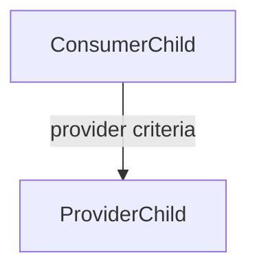

## Scope

Applies when creating, updating, reviewing, or validating specifications through the repository's spec system.

## Design Constraints

- Prefer one clear owning spec per behavior or requirement slice.
- Keep specs focused on system properties, acceptance criteria, evidence, and non-goals.
- Keep implementation plans, rollout sequencing, and execution notes in tickets unless they materially affect the contract.
- Preserve traceability between specs, tickets, validation evidence, and neighboring specs.

## Spec Quality — Standing Obligations

These rules apply whenever spec work is involved, not only when editing spec-system code.

### Orientation (start of every session)

Before writing or editing a spec:

- search existing specs for the behavior first
- search related tickets so the spec can link the current execution plan
- check whether a neighboring or parent spec already owns the requested slice

Prefer `spec-mcp` and `ticket-mcp` tools when available. Fall back to `./target/debug/spec.exe` and `./target/debug/ticket.exe` when needed.

### Rule-Governed Introduction by Readiness

Every spec must be introduced in-session by a governing PolicyRule, conditioned on the spec's computed readiness status:

- **implemented** — present the spec as a live, fully dependable contract dependents can immediately rely on.
- **partial-with-gaps** — present the spec but list the explicit unimplemented positions so agents do not assume gaps are complete.
- **coming-soon / not-implemented** — present a "coming soon" note so agents know the spec is defined but unimplemented.

This keeps spec availability legible to agents, avoids context bloat, and ensures every active spec has an active governing rule.

### Discovery Before Creating

Always search for an existing spec before creating a new one. Duplicate specs weaken the repository contract.

Prefer updating a matching spec when:
- the behavior belongs to the same component and scope
- the existing spec can absorb the acceptance criteria without becoming unfocused
- the requested change is a refinement rather than a new contract slice

Create a new spec when:
- the requested behavior is a distinct contract slice
- the existing spec would become too broad or mix unrelated concerns
- the new work needs its own acceptance criteria and evidence trail

## Spec Authoring Workflow

### Component Hierarchy

When a request names independently addressable components, create one thin parent root and one child spec per component. The root carries only shared motivation, cross-component invariants, and the component relationship map; each child MUST set `parent` to that root and own its component contract. Root specs MUST NOT carry per-component acceptance criteria.

Create the root first, then create each child with:

```bash
spec create --workspace <repo-root> --title "<child-title>" --slug <child-slug> --component <component> --parent <root-id-or-slug>
```

Use the [spec-editor hierarchy](../../../.spec/specs/788e91e4-32d7-4ff5-bf68-485235f8211f/body.md) as the imitable precedent.

### Code-First Structure and Relationship Traceability

Every code-facing spec MUST use the applicable section template below. The
existing aligned-structure requirements remain mandatory content: place the
dependent expectation, guards, positions, and governing rule where the
prescribed headings make that evidence clearest.

Child specs start with concrete code, not abstract prose. They MUST use these
sections in order:

1. `## Target Code Location` — repo-root-relative owning paths as clickable
	links; this is the first substantive section.
2. `## Naming Conventions` — concrete public types, identifiers, file names,
	and the component's criterion-id scheme.
3. `## Requester Input` — only when a human directive drove the component;
	use an H2 decision/task heading followed immediately by a verbatim
	blockquote.
4. `## Reading Order` — clickable links to governing docs, target code, and
	every sibling or provider spec the component consumes.
5. `## Responsibility`, `## Interfaces And Dependencies`, `## Behavior`, and
	`## Boundaries And Failure Cases` — the component contract required below.
6. `## Provider/Consumer Contract` — directed consumer-to-provider links and
	the provider criteria consumed.
7. `## Examples` — at least one concrete worked example that describes exactly
	what the component must do.
8. `## Evidence` and `## Scope`.

Parent specs carry shared motivation and cross-component invariants. They
MUST include a `## Reading Order` numbered clickable link list to every child
and governing document, plus a `## Component Relationship Map` with a
`flowchart TD` Mermaid graph of subcomponents and their directed edges. A
parent MAY own ordinary `CriterionArtifact` records for its composition graph:
the expected direct-child `component_id` values, required child shape, and
required inter-child provider/consumer edges. These use the normal criterion
artifact, validation, and evidence shape. A parent MUST NOT restate or own a
child's internal criteria or provider-owned criteria.

Every reference to another spec, ticket, doc, or code file MUST be a clickable markdown link following the [Clickable Reference Policy](../../../AGENTS.md#clickable-reference-policy) in `AGENTS.md`.

Directed component edges are the durable contract between components and MUST be authored to mirror one-to-one onto the typed edge model: consumer -> provider -> provider criteria. Until the store persists typed edges and `spec health` validates TOML-to-body link parity, record edges in the parent `flowchart TD` map and each child's `## Reading Order` provider links; this parity is review-enforced today and will become health-enforced later by the [Component-Oriented Specification System](../../../.spec/specs/f1b8f01a-c7da-4a71-97c5-39519a7d7f38/body.md).

Omit a mandated section that would only hold a placeholder. A `## Target Code
Location` or `## Examples` section that names no real path, type, or behavior
is incomplete and MUST be rejected in review.

Copy this structure rather than inventing a new one:

````markdown
# Parent Title

## Motivation

## Reading Order

1. <governing document link> — <purpose>
2. <child spec link> — <purpose>

## Component Relationship Map



## Shared Invariants

## Examples

## Scope
````

```markdown
# Child Title

## Target Code Location

## Naming Conventions

## Requester Input

> <verbatim human directive>

## Reading Order

1. <governing document link> — <purpose>
2. <provider spec link> — <criteria consumed>

## Responsibility

## Interfaces And Dependencies

## Behavior

## Boundaries And Failure Cases

## Provider/Consumer Contract

## Examples

## Evidence

## Scope
```

### Choose Component, Slug, and Parent

- Use the owning subsystem or workflow area as the component.
- Keep slugs lowercase, use `-` within segments, and `/` between segments.
- Every component child MUST set `parent` to its root. Root specs are reserved for shared scope; they may own ordinary composition criteria but MUST NOT restate a child's internal or provider-owned criteria.
- Avoid creating shallow duplicate siblings with overlapping goals.

### Structure the Spec (aligned-structure:v2)

Each spec must act as a dependable, verifiable contract. Every spec must start with the `<!-- aligned-structure:v2 -->` template marker and include the following five required content items within the applicable code-first template:

1. **Motivation ("why")** — The user requirement or behavior need this spec satisfies, with optional links to feedback explaining its origin.
2. **Dependent expectation** — An explicit, clear contract clause: "If this spec is implemented, dependents can rely on behavior X."
3. **Guards** — Declared test-api `ValidationSpec` ids that gate the spec. The spec's `verified` state is COMPUTED from guard execution outcomes, never hand-set.
4. **Positions** — Current implementation/readiness status per referenced code symbol/path: `implemented`, `partial`, `not-implemented`, or `deprecated` with an explicit `code_ref`.
5. **Governing-rule requirement** — Link to the PolicyRule(s) that must introduce/explain this spec in-session (governed by the rule-introduces-spec mechanism).

Acceptance criteria and guards must be concrete enough that a reviewer or automated tool can tell exactly what evidence proves the contract is satisfied.

#### Anti-Boilerplate Gate

Every child spec MUST state its responsibility, interfaces and dependencies, observable behavior, boundaries and failure cases, and concrete acceptance evidence. Omit any mandated section that would contain only a placeholder. A one-sentence purpose with no behavior, boundary, or failure detail is incomplete and MUST be rejected in review; for example, "Capture the requested outcome and any open questions that must be resolved before durable planning." is not a sufficient component contract.

### Link Tickets, Tests, and Related Specs

Specs should explicitly link the work needed to satisfy or verify the contract.

- Link the exact related ticket folder paths returned by ticket tools. Do not synthesize ticket paths.
- Render ticket references per the Clickable Reference Policy in `AGENTS.md`.
- Record the validation plan or completed validation results needed to evaluate the spec.
- Link related specs when they define prerequisites, shared contracts, or adjacent behavior.
- When docs or generated guidance are part of the deliverable, include them in the traceability or evidence section.

Use a clear evidence vocabulary when possible, including validation commands, expected evidence objects, and blocked or passing results.

### Validation Before Review

Before moving spec work toward review, verify:
- the acceptance criteria are testable
- the linked tickets are sufficient to execute the work
- the validation evidence is concrete, not implied
- related specs are linked where cross-spec behavior matters
- the spec still describes the contract, not a ticket-sized implementation plan

## Workflow Expectations

- When requirements, goals, or behavior change, create or update the relevant spec before implementation.
- When implementation reveals a contract change, update the spec and its evidence trail immediately.
- Keep ticket links, validation results, and related spec references current enough that another agent can continue the work without reconstructing intent.
- Use the Spec Agent when work is primarily about creating or refining specs rather than implementing code.
- If ambiguity remains after focused search, ask one concise clarification instead of guessing.
