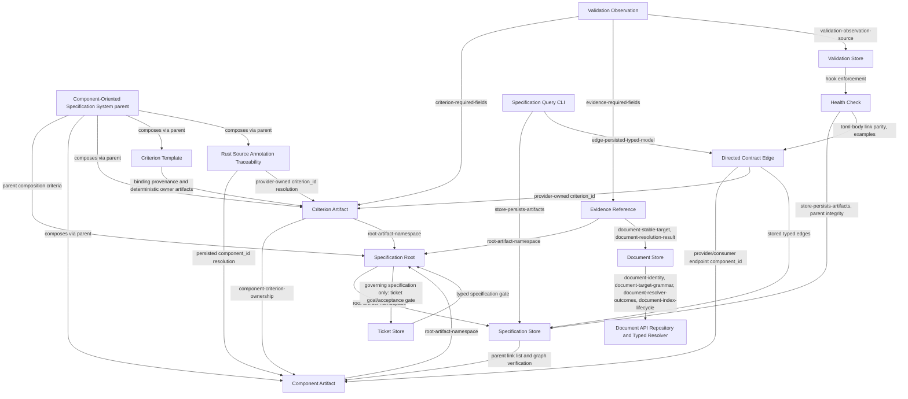

<!-- aligned-structure:v2 -->

# Component-Oriented Specification System

## Motivation

Define a code-first, component-owned specification model whose durable manifest
data, markdown navigation, generated index, CLI output, and health enforcement
can be reviewed as one traceable contract.

## Review Status

Reviewed and explicitly approved by the user on 2026-08-23 as
implementation-ready for Waypoint 6 ticket planning, together with the bounded
[fa6e85c8 Worktree Control Component Pilot](../fa6e85c8-866c-4d53-bb50-b78bd651e8ce/body.md).
This approval covers the target contracts only. It does not claim that v2 typed
persistence, migration, component edges, templates, `TypedTarget`, annotations,
health/hook enforcement, the shared operation journal, document resolution, or
proportional ticket gating are implemented. Waypoint 6 is unblocked for ticket
planning.

## Reading Order

1. [.agents/instructions/spec/spec-system.instructions.md](../../../.agents/instructions/spec/spec-system.instructions.md) - canonical authoring and relationship-traceability rules.
2. [90e4fb79 Production Workflow Cycle](../90e4fb79-2c60-42a6-ab10-91d243693150/body.md) - governing request-to-spec-to-ticket workflow neighbor.
3. [a608f774 Specification Root Contract](../a608f774-9f50-4de1-90e2-ffeefb0198b1/body.md) - root namespace and surviving manifest fields.
4. [fdb7645d Component Artifact Contract](../fdb7645d-eac5-4b82-88eb-94cb22f1b0b2/body.md) - code-facing component participant and required location metadata.
5. [aebcbab4 Criterion Artifact Contract](../aebcbab4-2827-4ea1-8244-0a2e6277b571/body.md) - provider-owned acceptance obligations.
6. [7498bed7 Evidence Reference Contract](../7498bed7-ac74-4484-b50e-8a9cf96d8431/body.md) - external evidence identity and location.
7. [ad0685f5 Directed Contract Edge](../ad0685f5-cb35-4c61-b1dc-f69232521e25/body.md) - persisted consumer-to-provider criterion edges.
8. [83c0b9c4 Validation Observation Contract](../83c0b9c4-1617-4751-af23-57811060f0fb/body.md) - optional criterion evidence outcomes.
9. [55d8f2eb Specification Store Contract](../55d8f2eb-70f1-4b90-8c8f-e50d5e311d48/body.md) - manifest persistence, hierarchy, and catalog rendering.
10. [b4475214 Specification Health Check](../b4475214-e14e-4926-b853-b2553444e36f/body.md) - structural, parity, hierarchy, and example checks.
11. [f482eb83 Ticket Store Integration](../f482eb83-5b47-4ea3-8d5b-b7baa0531333/body.md) - governed-ticket prerequisite.
12. [73817390 Document Store Evidence Integration](../73817390-7e6a-427a-a644-626718d9f25d/body.md) - stable document-target integration.
13. [224f9384 Document API Repository, Identity, and Typed Resolver Contract](../224f9384-c38f-4d8b-855e-a8b2457887ca/body.md) - doc-api repository, identity, target parser, and outcome provider.
14. [89360ad7 Validation Store Evidence Integration](../89360ad7-d638-49e7-85ba-21839fa99851/body.md) - validation evidence and hook enforcement.
15. [ef4cbcd7 Specification Query And Link Resolution CLI](../ef4cbcd7-9544-4c43-9095-59822b4211b6/body.md) - full persisted-data projection and TOML link resolution.
16. [e82b9727 Criterion Template Contract](../e82b9727-0ea2-4d1d-ab8a-98141f85caef/body.md) - reusable parameterized criterion expansion.
17. [7766e61d Rust Source Annotation Traceability Contract](../7766e61d-dea9-4292-bde5-dfc287b8da3b/body.md) - specified-but-not-built Rust item traceability.
18. [Presentation automation planning dossier](../../../transcripts/20-08-2026_presentation-automation-planning/README.md) - external related effort owning source locks, fact/projector extraction, and Slidev generation/validation through planned [1500a9e6 Conceptual deck contract](../../../.ticket/tickets/1500a9e6-293f-4803-969d-0dcabeaa470a), [693763fc Typed projections](../../../.ticket/tickets/693763fc-e4c1-4c93-b39f-5e0958b57d19), and [ec1f452d Deck materialization](../../../.ticket/tickets/ec1f452d-8eba-488c-bcfe-8dd8728130f1), coordinated by [0ee95228 Presentation epic](../../../.ticket/tickets/0ee95228-475d-4706-a108-fd208f7c4098) under Presentation System spec `2ccde9ee`.

## Component Relationship Map

## Shared Invariants

- Every component is a spec with an immutable, human-readable `component_id`.
	The manifest UUID remains storage identity and `slug` remains renameable
	navigation only. `component_id` is unique across the `SpecStore` and changes
	only through an explicit journaled migration.
- The new canonical layout has `format_version = 2`. Every component spec
	persists canonical typed artifact tables; a parser recognizes v2 only from
	that explicit version, never from the presence or absence of fields. Legacy
	migration consumes a reviewed explicit mapping file from legacy spec UUID to
	immutable `component_id`; it is journaled and idempotent and never invents a
	component identity.
- `parent` is the typed composition relation. Parent-owned composition criteria
	are ordinary `CriterionArtifact` records with the normal validation and
	evidence shape. They assert expected child `component_id` values, child
	shape, and required inter-child provider/consumer edges. Containment is not a
	provider/consumer edge, and these criteria do not restate child-internal or
	provider-owned criteria.
- A governing specification is reserved for ticket goal/acceptance gating.
	Parent-owned criteria may require a child component's existence, structure,
	or relationship, without taking ownership of that child's criteria.
- A provider exclusively owns `CriterionArtifact` records. Each artifact has a
	stable `criterion_id`, `owner_component_id`, behavior, measurement, optional
	template provenance and binding values, and validation-evidence links; a
	consumer stores only its directed edge to provider criterion ids.
- The concrete `workflow-tools/spec` parent may compose `spec-api`, `spec-cli`,
	and `spec-mcp`; CLI/MCP parity may require both transports to consume shared
	API behavior rather than duplicate it. Those component specs are
	specified-but-not-built until separately authored.
- Provider-owned `outward_contract_edges` persist distinct root-local provider/consumer
	records whose deterministic ids are `edge-<consumer>-consumes-<provider>-<name>`, whose provider is the owning component, and whose lexicographically serialized criterion ids do not overlap across named rows for a pair. `CriterionTemplateBinding`
	records bind a template id/version and parameters to one concrete provider
	criterion artifact; templates are neither components nor edges. Health
	independently validates composition, edges, bindings, deterministic expansion,
	collisions, and owner identity. Rust annotations resolve persisted
	`component_id` and `criterion_id` values; `CodeRef` remains a fallback.
- Every code-facing child has a manifest `code_refs` location and a concrete
	naming convention; every parent body lists and graphs its direct children.
- The future structured links in `spec.toml` and the clickable links in `body.md`
	must represent the same edge set. This is a draft requirement: current health
	checks do not parse body links or persist component edges.
- An unvalidated criterion remains structurally complete. Health reports shape,
	reference, hierarchy, and authored-document drift rather than fulfillment.
- A governing specification's `governs_ticket` relation and the ticket store's
	typed gate record are distinct, bidirectional traceability records. Neither
	is a `ComponentContractEdge` nor generic `related_tickets`/`related_specs`
	metadata.
- Parent Reading Order links and Component Relationship Map graphs are
	handwritten authored navigation. Health verifies them and never rewrites
	`body.md`.
- Presentation derivation is outside this tree: `presentation-viewer` and
	presentation-api paths are not materialized in this checkout and remain
	specified-but-not-built in the related Presentation System effort.

## Examples

A specification root with component `spec-api` declares a `Health Check`
component. Its manifest stores the component's `code_refs`, its body links the
Specification Store provider, and its `health-link-parity` criterion is consumed
by a Validation Store hook edge. The catalog renderer then verifies that this
root lists the Health Check child and includes the matching graph node and edge.

## Scope

This draft root owns only the cross-component navigation and invariants. The
fourteen children own behavior, failure cases, provider criteria, and
evidence; no implementation ticket is linked pending user review.